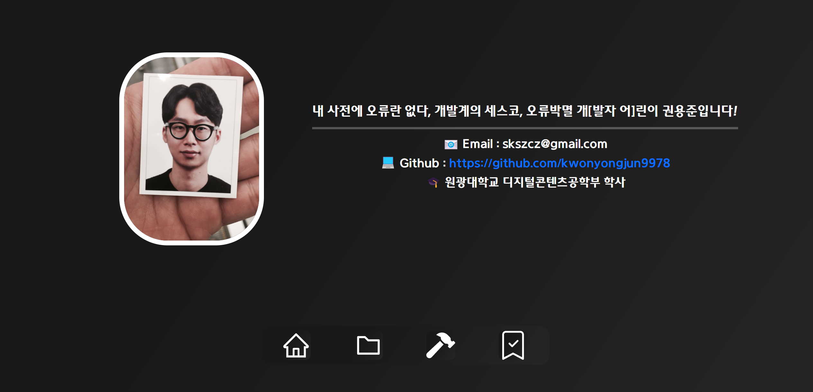

## 과제2

React를 사용하여 만든 포트폴리오입니다.

### 구현 사항

- Home page
- Stacks page
- Project page 
- Task(전달된 이미지 만들기 과제를 해당 페이지에서 작업했습니다.)
- react-router-dom을 사용한 페이지 이동
- react-bootstrap을 사용하여 Project page에 Card,Modal,Accordion,Button 기능 구현
- react-tooltip을 사용하여 페이지 하단에 메뉴버튼을 구현

